# Facebook Messenger Chatbot Setup

Hướng dẫn từng bước để tạo chatbot Messenger

## Yêu cầu

- Tài khoản [Facebook Developer](https://developers.facebook.com/)
- Fanpage Facebook

## Các bước cấu hình

### 1. Tạo Fanpage Facebook

Vào Facebook → Tạo trang mới.

---

### 2. Tạo ứng dụng

Truy cập [Meta for Developers](https://developers.facebook.com/apps/) → **Create App**  
Chọn loại ứng dụng phù hợp (Business / Other).

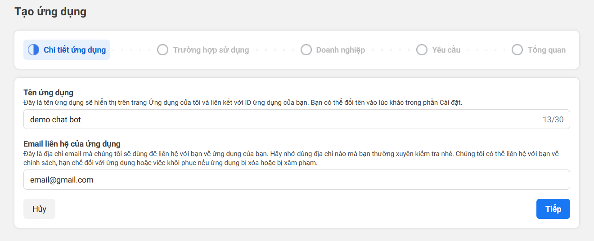  
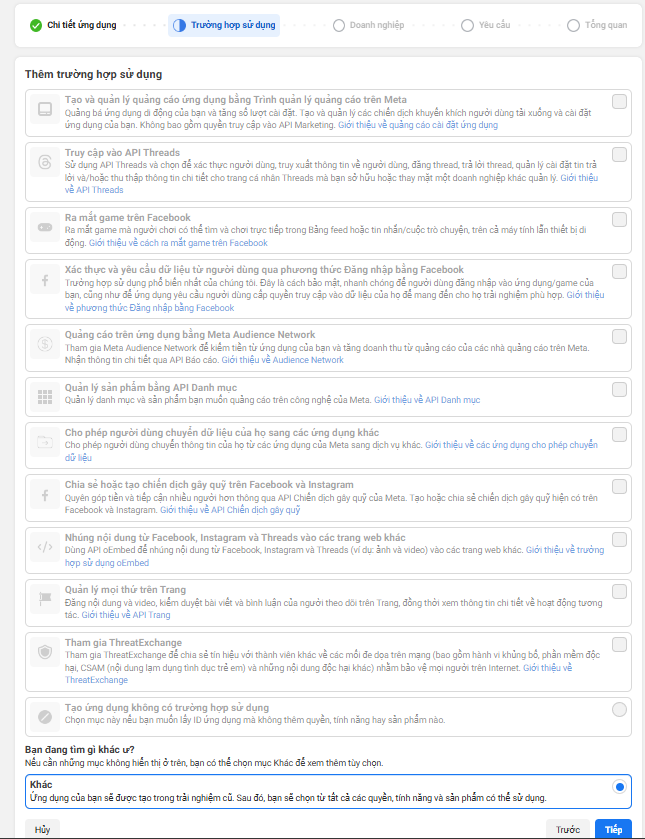  
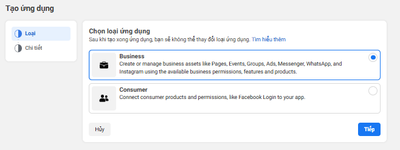  
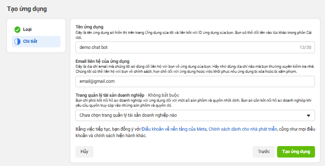

---

### 3. Thiết lập Messenger

Chọn **Messenger** trong App Dashboard → Bật.

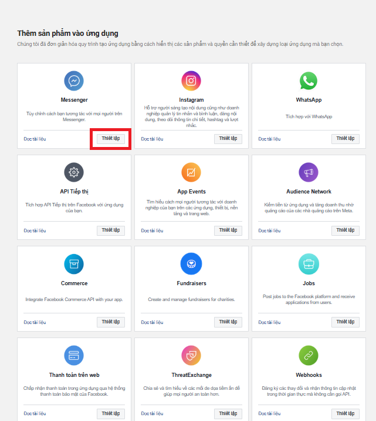

---

### 4. Đăng ký Webhook

Nhập **Webhook URL** và **Verify Token** (tự tạo, lưu trong `.env`).

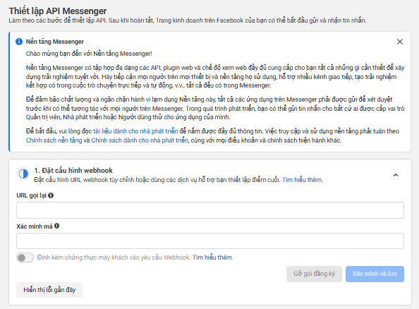  
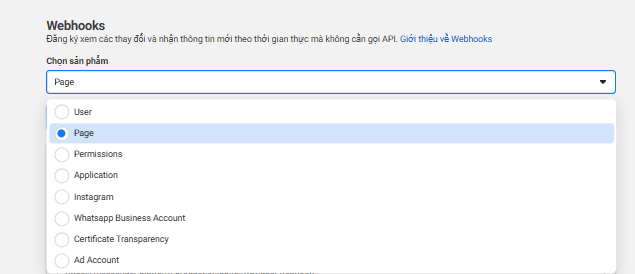  
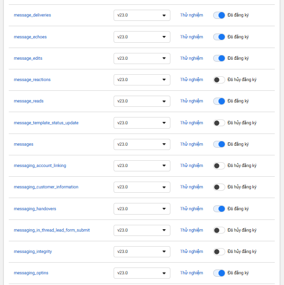

---

### 5. Kết nối với Fanpage

Chọn fanpage đã tạo để kết nối.

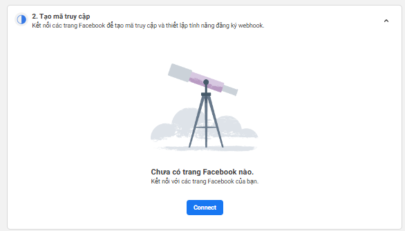

---

### 6. Đăng ký các trường thông tin (webhook fields)

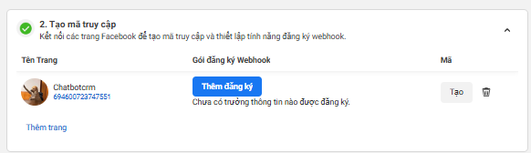
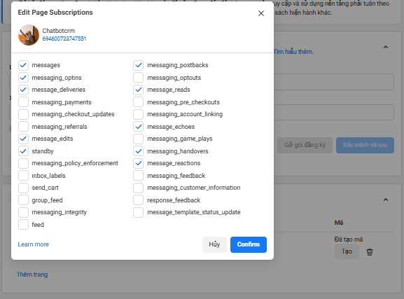

---

### 7. Tạo Page Access Token

Copy **Page Access Token** và lưu vào `.env`.


---

### 8. Chuyển ứng dụng sang chế độ chính thức

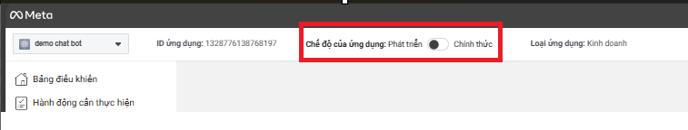

---

### 9. Thêm URL Chính sách Quyền riêng tư

Có thể tạo nhanh tại [Free Privacy Policy Generator](https://app.freeprivacypolicy.com/wizard/privacy-policy).

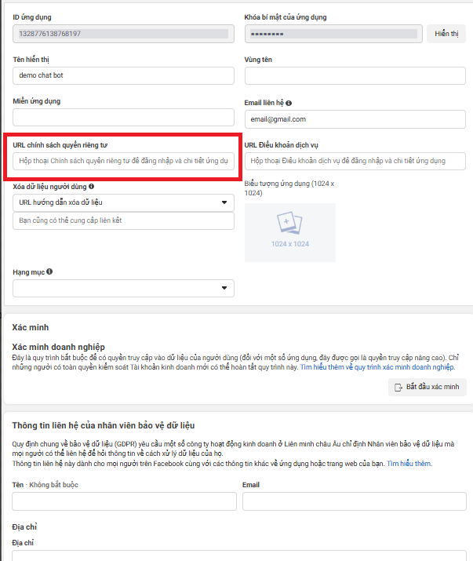

---

## 📤 Gửi tin nhắn qua Facebook Messenger API

## 🔗 Xác thực Webhook với Facebook Messenger

Khi bạn đăng ký **Webhook URL** trong Facebook Developer, Meta sẽ gửi một request `GET` tới URL đó để **xác thực**.  
Server cần trả về `hub.challenge` nếu `hub.verify_token` khớp với token đã cấu hình.

```ts
import { Controller, Get, Query, Res } from '@nestjs/common';
import { Response } from 'express';
import { ConfigService } from '@nestjs/config';

@Controller('webhook')
export class MessengersController {
  constructor(private readonly configService: ConfigService) {}

  @Get()
  verifyWebhook(
    @Query('hub.mode') mode: string,
    @Query('hub.verify_token') token: string,
    @Query('hub.challenge') challenge: string,
    @Res() res: Response,
  ) {
    if (
      mode === 'subscribe' &&
      token === this.configService.get('FB_VERIFY_TOKEN')
    ) {
      console.log('WEBHOOK_VERIFIED');
      return res.status(200).send(challenge);
    }
    return res.sendStatus(403);
  }
}
```

Sau khi webhook được xác thực, Facebook sẽ gửi các sự kiện (`messages`, `message_reads`, `postbacks`, ...) tới endpoint của server bằng `POST`.

Sau khi đã có **Page Access Token** và **PSID (Page Scoped ID)** của người dùng, đã có thể gửi tin nhắn bằng cách gọi Facebook Graph API:

````ts

@Post()
  async handleMessage(@Body() body: any, @Res() res: Response) {
    if (body.object === 'page') {
      for (const entry of body.entry) {
        const event = entry.messaging[0];
        const senderId = event.sender.id;
        if (event.message && event.message.text) {
          const text = event.message.text;
          await this.messageQueue.add('chat-message', {
            senderId,
            text,
          });
        }
      }
      return res.status(200).send('EVENT_RECEIVED');
    } else {
      return res.sendStatus(404);
    }
  }

import axios from 'axios';

const apiUrl = 'https://graph.facebook.com/v23.0/me/messages';

async function sendMessage(senderId: string, text: string) {
  try {
    await axios.post(`${apiUrl}?access_token=${this.configService('PAGE_ACCESS_TOKEN')}`, {
      recipient: { id: senderId },   // Người nhận (PSID)
      message: { text: text },       // Nội dung tin nhắn
    });
    console.log('Message sent successfully');
  } catch (error) {
    console.error('Error sending message:', error.response?.data || error.message);
  }
}


## Cấu hình môi trường

Tạo file `.env` trong project:

```env
PAGE_ACCESS_TOKEN=<your_page_access_token>
FB_VERIFY_TOKEN=<your_verify_token>
````
